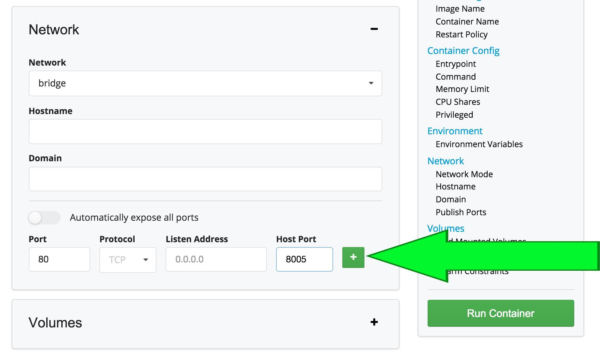
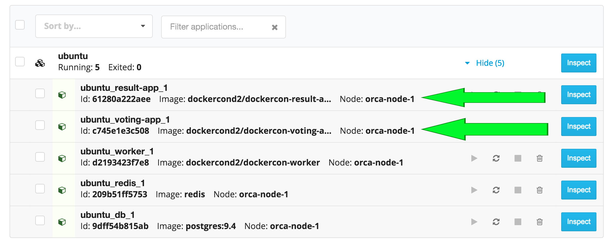

##NOTE
This lab is for participants of the Docker Universal Control Plane beta program. It will not work unless you have access to the UCP binaries. 

##Introduction
This lab will guide you through 5 tasks with Docker Universal Control Plane:

- Task 1: Install Docker Universal Control Plane on ducp-0

- Task 2: Add ducp-1 as a second managed node

- Task 3: Create an Nginx container

- Task 4: Download the Client bundle to ducp-2

- Task 5: Use Docker Compose from ducp-2 to stand up an app

It should take 25-35 minutes to finish. 

##What is Docker Universal Control Plane
Docker Universal Control Plane is a an on-premise solution to help you manage your Docker-based applications. 

## Prerequisites

- This lab assumes you've created 3 Docker hosts running Docker Engine 1.9. These hosts should be named ducp-0, ducp-1, and ducp-2. 

- You will need fully qualified domain name (FQDN) and IP address for each host.

- You will need a Docker hub account that has been given permission to access the Docker Universal Control Plane beta.

- The following ports need to be accessible on all of you hosts for UCP to function:

	- 443: 			UCP controller
	- 2376: 			Swarm manager
	- 12376: 			Engine proxy
	- 12379, 12380: 	Key Value store
	- 12381: 			Swarm CA service
	- 12382:			UCD CA service

- The following ports are used as part of this lab:
	- 8005: 			Nginx container created in Task 3
	- 5000, 5001:		Voting containers deployed in Task 5

##Task 1: Installing Docker Universal Control Plane
In this task we're going to install the Docker Universal Control Plane (UCP) server onto **ducp-0**. This is done by running a bootstrap container, and providing a few pieces of information. 

**Note***: Some dialogs / logs may say "Orca" this is the internal code name for UCP*

1. ssh into **ducp-0**

		$ ssh -i <indentity file> ubuntu@<ducp-0 public ip>
	
 	**Note***: You may be prompted to accept the RSA key. If so, enter* `yes` 

2. Run the UCP installer

		docker run --rm -it -v /var/run/docker.sock:/var/run/docker.sock --name ucp dockerorca/ucp install -i
		
3. Provide the following inputs:

	- Password: `<password of your choosing>`
	- Additional Aliases: `<ducp-0 FQDN>` `<ducp-0 IP>`
	- Your Docker hub credentials
	 
	  **Note***: Do not use the private IP. Use the one labled "IP"*

	The UCP installer should finish something similar to:
	
		INFO[0160] Installing UCP with host address 172.31.42.38
		INFO[0002] Generating Swarm Root CA
		INFO[0013] Generating UCP Root CA
		INFO[0022] Deploying UCP Containers
		INFO[0027] UCP instance ID: JJOB:SQP3:PERQ:UPP3:54UP:K7B6:ZWL6:GLES:CN7M:5KLO
		INFO[0027] UCP Server SSL: SHA1 Fingerprint=48:22:4F:6B:36:6D:
		INFO[0027] Login as "admin"/(your admin password) to UCP at https://<ducp-0 IP>:443

**Note***: If you are deploying to an EC2 istance, the installer may indicate the server is reachable on the `private IP`, but instead use your web browser navigate to the UCP server via ducp-0's `public IP`*
	
**Note***: You may be warned that your connection is not private. That is 	because we are not using publicly signed certificates for the SSL connnection to the website.*
	
*To bypass this in Chrome click `advanced` and then `proceed to . . . .` link. Safari may net let you past this warning*
	
2. Login into the UCP server with the username `admin` (case sensitive) and the password you chose. 
	
You'll be logged into the UCP dashboard. Notice you have several containers and images, as well as 1 node, and 0 applications running. These images and containers are what power the UCP server.
	
##Task 2: Deploy a Second Docker Host
In this step we'll add a 2nd node (**ducp-1**) to our cluster. 

1. In a new terminal session ssh into **ducp-1**

		$ ssh -i <identity file> ubuntu@<ducp-1 public ip>
	
 	**Note***: You may be prompted to accept the RSA key. If so, enter* `yes`

2. Run the UCP bootstrap with the join option

		docker run --rm -it  -v /var/run/docker.sock:/var/run/docker.sock --name ucp dockerorca/ucp join -i

3. Provide the following inputs:

	- URL to the Orca server: `https://<ducp-0 IP>`
	- Proceed with the join: `y`
	- Admin username: `admin`
	- Admin password: `<password>`
	- Docker Hub credentials
	- Additional Aliases: `<ducp-1 FQDN>` `<ducp-1 IP>`

	The Installer should finish with something similar to:
	
		INFO[0000] This engine will join UCP and advertise itself with host address 10.0.11.13
		INFO[0000] Verifying your system is compatible with UCP
		INFO[0012] Starting local swarm containers
	
4. Go back to your web browser, and refresh the dashboard. You should now see you have 2 nodes running. 

5. Click `Nodes`

	Here you can see details on both of your running nodes

##Task 3: Create a Container
In this section we'll deploy an Nginx container using UCP

3. In the UCP UI click the menu button in the upper left corner

	

4. From the drop down select `Containers`

5. On the Control Plane / Containers page, click `+ Deploy Container`
	
6. Provide the following inputs:

	- Image Name: `nginx:latest`	
	- Container Name: `mynginx`
	- Under Network set port 80 to redirect to 8005 and click the `+` button

	
	
	Feel free to examine the other settings, but leave them at their defaults
	
5. Click `Run Container`

	
	
6. Click the magnifying glass next to  your container, 

	

	Scroll down to the node section of the page to find out 	which node your webserver is 	running on (`ducp-0` or 	`ducp-1`)

	In your web browser navigate to the IP address (and port 	8005) of the node (`ducp-0` or `ducp-1`) where Nginx is 	running. 
	
	

	For example: `http://52.23.41.23:8005`

	You should see the Nginx welcome screen.
	
## Task 4: Using UCP from the Command Line
One of the great things about UCP is that it doesn't preclude you from using the Docker command line tools you're used to. In this task we're going to install the UCP client bundle onto your local machine

1. Navigate to your UCP server in your web browser
	
2. In the upper right corner click `admin` and choose `Profile`

3. Click `Create a Client Bundle`
		
4. Navigate to where the bundle was downloaded, and unzip the client bundle
		
		$ unzip bundle.zip
		Archive:  bundle.zip
 		extracting: ca.pem
		extracting: cert.pem
		extracting: key.pem
 		extracting: cert.pub
		extracting: env.sh
		
5. Change into the directory that was created when the bundle was unzipped

6. Execute the `env.sh` script to set the appropriate environment variables for 	your UCP deployment

		$ source env.sh
		
9. Run `docker info` to examine the configuration of your Docker Swarm. Your output should show that you are managing the swarm vs. a single node. 

		$ docker info
		Containers: 10
		Images: 15
		Role: primary
		Strategy: spread
		Filters: health, port, dependency, affinity, constraint
		Nodes: 2
		 orca-ducp-0: 10.0.10.47:12376
		  └ Containers: 7
		  └ Reserved CPUs: 0 / 1
		  └ Reserved Memory: 0 B / 3.859 GiB
		  └ Labels: executiondriver=native-0.2, kernelversion=3.19.0-26-generic, operatingsystem=Ubuntu 14.04.3 LTS, storagedriver=aufs
		 orca-ducp-1: 10.0.11.13:12376
		  └ Containers: 3
		  └ Reserved CPUs: 0 / 1
		  └ Reserved Memory: 0 B / 3.859 GiB
		  └ Labels: executiondriver=native-0.2, kernelversion=3.19.0-26-generic, operatingsystem=Ubuntu 14.04.3 LTS, storagedriver=aufs
		CPUs: 2
		Total Memory: 7.718 GiB
		Name: orca-ducp-0
		ID: F4Q3:NJRJ:GZ3M:6TKK:KUEE:TRUO:AEFG:ET7U:RAP4:3RHW:HYOH:I2TK
		Labels:
 		swarm_master=tcp://10.0.10.47:2376
			 
##Task 5: Use Docker Compose 
In this task we'll use Docker Compose to stand up a multi-tier voting application. 
		
1. Use the editor of your choice to createa a file named `docker-compose.yml`, and copy the following commands into your new file. 

		voting-app:
  		  image: dockercond2/dockercon-voting-app
		  links:
		    - redis:voteapps_redis_1
		  ports:
		   	 - "5000:80"

		redis:
		  image: redis
		  ports: ["6379"]

		worker:
		  image: dockercond2/dockercon-worker
	  	  links:
		   	- redis:voteapps_redis_1
		    - db:voteapps_db_1

		db:
  		  image: postgres:9.4

		result-app:
		  image: dockercond2/dockercon-result-app
		  links:
		    - db:voteapps_db_1
		  ports:
		   	 - "5001:80"
		
4. Deploy the application. The compose file will start several different containers that comprise a voting app

		$ docker-compose up -d
		
	It will take several minutes for the compose to complete, and several lines of text will scroll by. It should finish similar to this

		Creating ubuntu_voting-app_1
		Pulling result-app (dockercond2/dockercon-result-app:latest)...
		orca-ducp-1: Pulling dockercond2/dockercon-result-app:latest... : downloaded
		orca-ducp-0: Pulling dockercond2/dockercon-result-app:latest... : downloaded
		Creating ubuntu_result-app_1
		
5. In your web browser navigate back to the UCP server dashboard (`https://<ducp-0 public IP>`)

	Notice the dashboard now shows 1 application running. 
	
6. Click on the menu icon and select `applications` from the drop down. 

	
	
7. List out all the running containers by clicking `Show` on the line listing the Ubuntu application

	

8. Click show to the on the Ubuntu application to find 	out which nodes your voting app and results are running 	(`ducp-0` or `ducp-1`)

	

	In your web browser navigate to the IP address (and port 5000) of the node (`ducp-0` or `ducp-1`) 	where the voting app is running. 

	For example: `http://52.23.41.23:5000` 
	
	Then navigate to the IP address (and port 5001) of the 	node (`ducp-0` or `ducp-1`) 	where the results app is 	running. 

	For example: `http://52.23.41.23:5001`

8. Navigate back to the applcation view in UPC, and click `inspect` next to any of the containers
	
	This shows us the details of the running container. We 	can control container state here. Aditionally we 	can scale out a given container. 
	
	Finally, the menu bar allows you to see performance 	stats, logs, and even 	open a console window into the 	container. 
	
	Feel free to explore these 	options. 

	
	
	

		

	

		
		
	
	
 

	
